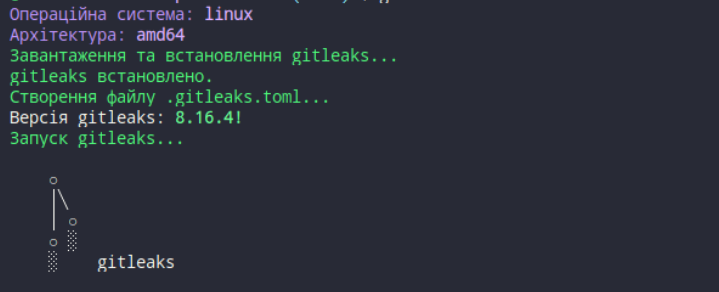
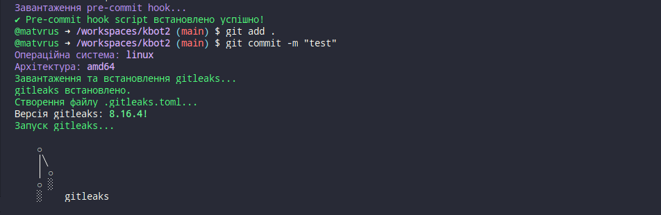
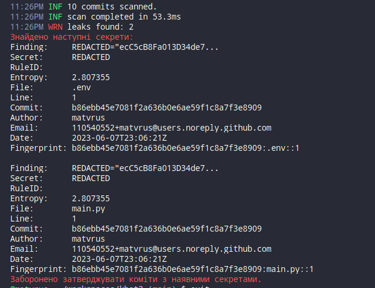

# pre-commit hook script with automatic installation of [gitleaks](https://github.com/gitleaks/gitleaks) and checks for sensitive information 🔒

✨ **Security Pre-commit Auto Script** ✨

  

This repository contains the `pre-commit-auto-script`, a script that helps automate the installation and configuration of `pre-commit` hooks in your Git repository. It utilizes [gitleaks](https://github.com/zricethezav/gitleaks) to enhance the security of your codebase. 😊



[](https://git.io/typing-svg)

## Table of Contents 📋🍽️ 📄
- [Overview](#overview)
- [Installation](#installation)
- [Requirements](#requirements-)
- [Enable or Disable Plugin](#enable-or-disable-plugin-)
- [Usage](#usage-)
- [DEMO](#demo-)
- [Check on clone](#check-on-clone)

### Overview

This repository contains the `pre-commit-auto-script`, a script that helps automate the installation and configuration of `pre-commit` hooks in your Git repository. It utilizes [gitleaks](https://github.com/zricethezav/gitleaks) to enhance the security of your codebase.

## Requirements 💾

Before using this script, make sure you have the following dependencies installed:

- Git ✔️
- Curl ✔️

## Installation

To install the script, simply run the following command in your terminal:

```bash
curl -sSfL https://raw.githubusercontent.com/ruslanlap/pre-commit-auto-script/main/install.sh | bash
```

### Enable🔔 or Disable plugin 🔕

✅ Enable:

```bash
source on-off-gitleaks.sh; enable
```

❌ Disable:

```bash
source on-off-gitleaks.sh; disable
```

### Usage 🚀

After running the installation command, it will automatically install and configure `pre-commit` hooks for your Git repository. It also integrates `gitleaks` to scan for sensitive information in your codebase and prevent leaks. 🛡️

You can review and customize the list of available hooks in the `.pre-commit-config.yaml` file, which will be created in the root directory of your project. For example, you can add more arguments to the `.gitleaks.toml` file.

### DEMO 🎥

Wondering how the script works? Take a look at this demo:






### Check on clone
# GitLeaks Scanner 🕵️‍♂️🔍

This Bash script automates the process of scanning a Git repository for sensitive information using Gitleaks.

## How it works

## Usage

1. Ensure Git and Gitleaks are installed and accessible in your environment.
2. Run the script and enter the Git repository URL when prompted.
3. Monitor the script's output for scan results and follow any actionable items indicated.

## Features

- **Clones** a repository from a specified URL into a local directory for scanning.
- **Runs Gitleaks** to detect potential leaks (such as passwords, API keys, etc.) within the cloned repository.
- **Provides color-coded feedback** throughout the process using ASCII art, emojis, and formatted messages.
- **Optionally cleans up** temporary files after scanning.

## Installation

To quickly install and use this script, run the following command:

```bash
curl -sSfL https://raw.githubusercontent.com/ruslanlap/pre-commit-auto-script/main/gitleaks_on_clone && chmod +x gitleaks_on_clone && ./gitleaks_on_clone
```
🔒 Stay secure with `pre-commit-auto-script` and `gitleaks`! Happy coding! 🚀

